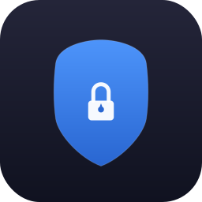

<p align="center">
  
</p>

<h1 align="center">Privacy Shield</h1>

<p align="center">
  A lightweight macOS menu bar app that covers all displays with a full-screen privacy overlay while keeping your running tasks active.
</p>

---

It is designed for quick visual privacy, not system-level security. Use it when you need to hide on-screen work from people nearby without interrupting long-running terminal jobs, browser automation, or other active processes.

## Features

- Full-screen black overlay across all connected displays
- Menu bar app with a quick activate action
- Global shortcut: `Control + Command + L`
- PIN-based unlock flow
- Simple prototype implementation in `Swift + AppKit`

## Run

```bash
cd privacy-shield
swift run
```

After launch, a `Shield` item appears in the macOS menu bar.

If your machine only has Command Line Tools installed, `swift run` may fail because `xcrun` cannot resolve the full macOS SDK. In that case, install full Xcode or switch `xcode-select` to a full Xcode installation.

## GitHub Actions

This repository includes a GitHub Actions workflow at `.github/workflows/build.yml`.

- Pushes to `main` and pull requests run `swift package resolve` and `swift build`
- Tags like `v1.0.0` also build a macOS app bundle and publish `PrivacyShield-macos.zip` to GitHub Releases

This project imports `AppKit`, so the build must run on a macOS runner rather than Linux.

## Usage

- Click `Shield` in the menu bar and choose `Activate Shield`
- Or press `Control + Command + L`
- Press `Return` or click anywhere to open the unlock prompt

Default PIN:

```text
2468
```

You can change it from `Shield > Set PIN`.

## Project Structure

```text
privacy-shield/
├── Package.swift
├── README.md
├── LICENSE
├── Sources/
│   └── PrivacyShield/
│       └── main.swift
└── packaging/
    ├── Info.plist
    ├── icon.svg
    └── generate-icon.swift
```

## Known Limitations

- This is a privacy overlay, not a real macOS lock screen
- It is meant to stop casual viewing, not a determined person using your machine
- The current PIN is stored in `UserDefaults`, which is fine for a prototype but not for hardened security

## License

MIT
